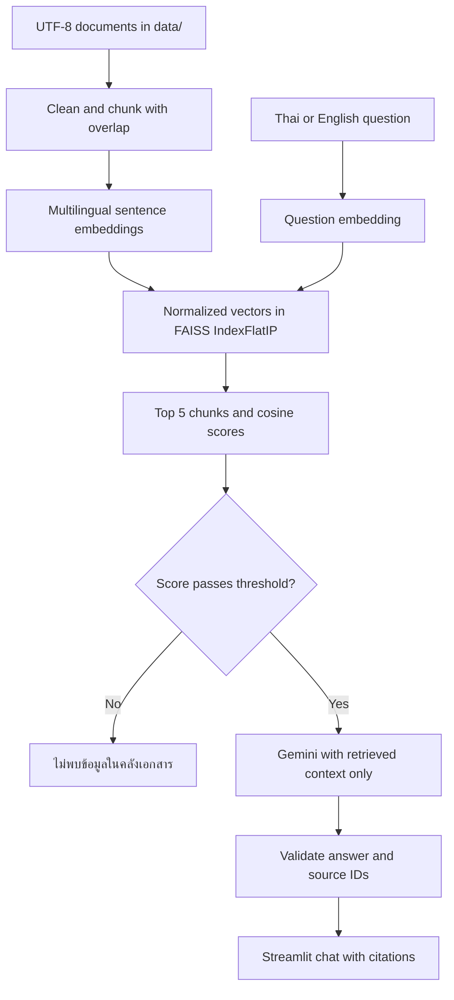

# Network Troubleshooting RAG Assistant

แชตบอตภาษาไทย/อังกฤษสำหรับเรียนรู้และวิเคราะห์ปัญหาเครือข่ายจากคลังเอกสารที่จัดเตรียมไว้ ช่วยลดการค้นหาข้ามหลายหัวข้อและแสดงหลักฐานประกอบคำตอบ เหมาะกับงานมหาวิทยาลัยที่ต้องสาธิต RAG โดยตรง ไม่ควรนำคำแนะนำไปเปลี่ยนระบบจริงโดยไม่ตรวจ platform และสิทธิ์ดำเนินการ

## สถาปัตยกรรมและขั้นตอนทำงาน



1. `load_documents()` อ่านไฟล์ `.txt` จาก `data/` ด้วย UTF-8 และเก็บชื่อไฟล์
2. `clean_text()` ปรับช่องว่างและ normalize ภาษาไทยด้วย PyThaiNLP โดยรักษาย่อหน้า
3. `chunk_documents()` รักษาขอบเขตย่อหน้า แบ่งไม่เกิน 1,000 ตัวอักษร และตรวจด้วย tokenizer จริงให้ไม่เกิน 128 tokens รวม special tokens; เพิ่ม overlap สูงสุด 150 ตัวอักษรเฉพาะเมื่อยังอยู่ใน token budget แต่ละ chunk มี `source`, `chunk_number`, `text`
4. `load_embedding_model()` โหลด `sentence-transformers/paraphrase-multilingual-MiniLM-L12-v2` บน CPU ครั้งเดียวด้วย `st.cache_resource` รองรับไทยและอังกฤษ และสร้างเวกเตอร์ 384 มิติ
5. `build_faiss_index()` normalize embedding และใช้ `faiss.IndexFlatIP` ทำ inner product ซึ่งเท่ากับ cosine similarity เมื่อเวกเตอร์มีความยาวหนึ่ง
6. cache ของคลังความรู้เก็บ index และ chunks โดย hash เนื้อหาเอกสาร เมื่อไฟล์หรือรุ่น pipeline เปลี่ยนจะสร้างใหม่ ไม่ embed ทุกครั้งที่ Streamlit rerun
7. คำถามถูก embed และค้นหา Top-K = 5 แล้วกรองแต่ละ chunk ด้วย `RETRIEVAL_THRESHOLD` ก่อนส่งให้ LLM
8. Gemini ได้เฉพาะคำถามปัจจุบันและ retrieved context ประวัติแชตแสดงใน UI และคงอยู่ใน session แต่ไม่ส่งเป็นหลักฐานให้โมเดล คำถามต่อเนื่องควรระบุหัวข้อให้ครบ
9. ตรวจ JSON และ citation ให้เป็น source ID ที่ถูก retrieve จริง ก่อนแสดงข้อความพร้อมส่วนขยายอ้างอิง

## Threshold และการปฏิเสธคำถาม

ค่าที่ปรับจากชุดทดสอบ `RETRIEVAL_THRESHOLD = 0.38` อยู่ใกล้ต้น `app.py` หากไม่มี chunk ผ่าน จะตอบ **ไม่พบข้อมูลในคลังเอกสาร** ทันทีโดยไม่เรียก API และไม่แสดงแหล่งข้อมูลที่ไม่เกี่ยวข้อง หาก context ไม่พอ Gemini ถูกสั่งให้ตอบข้อความเดียวกัน หาก structured citation ถูกต้องแต่ไม่มี inline tag แอปจะเติม tag จาก ID ที่ตรวจแล้ว หาก JSON/citation ผิด จะแสดงข้อผิดพลาดรูปแบบคำตอบแยกจาก NOT_FOUND ไม่แสดงว่าเอกสารไม่มีข้อมูล การตรวจ citation ยืนยันว่าแหล่งอ้างอิงมีอยู่ แต่ไม่ได้พิสูจน์ทุกข้อเท็จจริงของโมเดล ต้องตรวจคุณภาพคำตอบด้วยผู้สอนด้วย

Cosine score ไม่ใช่ความน่าจะเป็น Threshold ต้องปรับจากผลชุดคำถามจริงเมื่อเปลี่ยนข้อมูลหรือโมเดล ชุดทดสอบมีคำถามเครือข่ายและนอกคลัง เช่น Kubernetes/Helm กับ PostgreSQL การผ่านชุดนี้ไม่รับประกันว่าจะแยกคำถามนอกคลังทุกแบบได้

## Prompt Engineering และ Gemini

ใช้ SDK สมัยใหม่ `from google import genai` กับ `genai.Client(api_key=st.secrets["GEMINI_API_KEY"])` โมเดลตั้งที่ `GEMINI_MODEL` ใน `app.py` ปัจจุบันเลือก `gemini-3.1-flash-lite` ตาม [รายการโมเดลและสถานะจาก Google](https://ai.google.dev/gemini-api/docs/deprecations) ตรวจ availability ในบัญชีและเปลี่ยน constant ได้เมื่อจำเป็น

ตัวอย่างคำสั่งหลักที่ส่งผ่าน system instruction:

```text
You are a Network Troubleshooting Assistant.
Answer ONLY from the provided retrieved context; never use outside knowledge.
Never invent commands, causes, configurations, solutions, or sources.
If evidence does not fully support an answer, set answer to exactly
'ไม่พบข้อมูลในคลังเอกสาร' and citations to [].
Answer in Thai for Thai questions and English for English questions.
Explain diagnosis logically. Cite every factual paragraph using [source_id].
Only cite IDs from the context. Return JSON with answer and citations.
```

Prompt จริงอยู่ใน `SYSTEM_PROMPT` และเพิ่มกฎไม่ทำตามคำสั่งแทรกในเอกสาร/คำถามและไม่เปิดเผย prompt ใช้ temperature ต่ำ ไม่ใช้ web grounding หรือความรู้ภายนอก API timeout 60 วินาที เมื่อไม่มี key แสดงวิธีตั้งค่า เมื่อ API มีปัญหาแสดงข้อความที่เข้าใจได้โดยไม่เผย traceback หรือข้อมูลคำขอ

## โครงสร้างโปรเจกต์

```text
network-troubleshooting-rag/
├── app.py
├── data/
│   ├── 01_osi_tcpip.txt
│   ├── 02_ip_subnetting.txt
│   ├── 03_vlan_trunking.txt
│   ├── 04_stp_rstp.txt
│   ├── 05_ospf.txt
│   ├── 06_dhcp_dns.txt
│   ├── 07_nat.txt
│   ├── 08_firewall_acl.txt
│   ├── 09_vpn.txt
│   └── 10_network_troubleshooting.txt
├── .streamlit/config.toml
├── .streamlit/secrets.toml.example
├── .gitignore
├── requirements.txt
├── test_questions.csv
├── test_rag.py
└── README.md
```

## ติดตั้งและรันในเครื่อง

แนะนำ Python 3.12 ในโฟลเดอร์โปรเจกต์:

```bash
python3 -m venv .venv
source .venv/bin/activate
python -m pip install -r requirements.txt
streamlit run app.py
```

บน Windows ใช้ `py -3.12 -m venv .venv` และ `.venv\Scripts\activate` เปิด URL ที่ Streamlit แสดง ปกติ `http://localhost:8501` ครั้งแรกต้องเชื่อมต่อ Hugging Face เพื่อดาวน์โหลด embedding model ครั้งถัดไปใช้ cache ในเครื่อง ติดตั้ง PyTorch แบบ CPU หากต้องลดพื้นที่ติดตั้งบน Linux:

```bash
python -m pip install torch --index-url https://download.pytorch.org/whl/cpu
python -m pip install -r requirements.txt
```

### Streamlit Secrets

สร้าง `.streamlit/secrets.toml` ในเครื่องเอง หรือใส่ในช่อง Secrets บน Cloud:

```toml
GEMINI_API_KEY = "your_gemini_api_key_here"
```

แทน placeholder ด้วย key ของตนเองจาก Google AI Studio ระบบอ่าน key จาก `st.secrets` เท่านั้น ไม่อ่าน `.env` หรือ environment variable ไม่ต้องเพิ่ม key ใน source code หากยังไม่มี key แอปเปิดได้และทดสอบการค้นหา/การปฏิเสธได้ แต่สร้างคำตอบจาก Gemini ไม่ได้

## ทดสอบ

```bash
python test_rag.py
```

ชุดทดสอบโหลดข้อมูลจริง ตรวจจำนวนเอกสารและตัวอักษร, chunking, overlap, embedding count/dimension/normalization, จำนวนเวกเตอร์ FAISS, relevant sources และคะแนนคำถามนอกคลัง รวมถึงตรวจว่าไม่เรียก Gemini สำหรับคำถามที่คะแนนต่ำ ทดสอบ citation ที่ผิดด้วย mock และใช้ Streamlit AppTest ตรวจหน้าจอ, missing secrets, ประวัติ และ Clear Chat ไม่มีการใช้ quota Gemini ในชุดทดสอบ

`test_questions.csv` มี 18 กรณีและ 3 `NOT_FOUND` รวมคำถาม regression ที่แจ้งมา หลังตั้ง key ให้ลองถามจริงและตรวจความถูกต้องกับเอกสารเพิ่มเติม ห้ามถือว่าการทดสอบ retrieval เป็นการทดสอบคุณภาพคำตอบ Gemini

## Deploy บน Streamlit Community Cloud

1. นำไฟล์โปรเจกต์ขึ้น repository ของตนโดยไม่รวม `.venv/` และ secrets จริง
2. บน Streamlit Community Cloud เลือก repository/branch และ entry point `app.py`
3. เลือก Python 3.12 ใน advanced settings และใส่ `GEMINI_API_KEY` ใน Secrets
4. Deploy แล้วรอการติดตั้งและดาวน์โหลดโมเดลครั้งแรก ตรวจ log ถ้า dependency หรือ network ล้มเหลว
5. ลองคำถามไทย อังกฤษ และคำถามนอกคลัง ตรวจ citation และ Clear Chat

ใช้ pathlib ไม่มี path เฉพาะเครื่องในแอป ไม่มีฐานข้อมูลหรือ backend เพิ่ม โมเดลและ index แชร์ด้วย cache_resource เพื่อประหยัด RAM จำนวนข้อมูลนี้มีขนาดเล็ก แต่ runtime ของ PyTorch ใช้หน่วยความจำมากกว่า index ควรเฝ้าดู resource หากเพิ่มข้อมูลจำนวนมาก requirements ระบุช่วง major version เพื่อช่วย compatibility ควรบันทึกรุ่นที่ทดสอบจริงเมื่อส่งงาน

## คลังความรู้และแหล่งเอกสาร

เอกสารทั้ง 10 ไฟล์ใน `data/` เป็นเนื้อหาการศึกษาที่เขียนใหม่สำหรับโปรเจกต์นี้ ใช้ภาษาไทยและศัพท์เครือข่ายอังกฤษ ไม่ใช่การนำ manual หรือเว็บไซต์ภายนอกเข้า index หัวข้อครอบคลุม OSI/TCP-IP, subnetting, VLAN, STP, OSPF, DHCP/DNS, NAT, ACL/firewall, VPN และวิธี troubleshooting ตัวอย่างคำสั่งระบุ platform เมื่อจำเป็น ต้องปรับ interface และ address ให้เข้ากับระบบจริง

ตัวอย่างคำถาม:

- OSPF neighbor ค้าง EXSTART ต้องตรวจอะไร?
- เครื่องต่าง VLAN สื่อสารไม่ได้ต้องตรวจ trunk และ gateway อย่างไร?
- DHCP client ไม่ได้รับ IP ต้องตรวจ DORA อย่างไร?
- DNS resolution fails but access by IP works. What should I check?
- VPN ส่ง packet เล็กได้แต่เว็บค้างเกี่ยวข้องกับ MTU อย่างไร?
- How do I troubleshoot TCP retransmission and duplicate ACK?

## ความปลอดภัยของ API Key

ห้าม commit API key เพราะผู้ที่เห็นสามารถใช้ quota และสิทธิ์ของบัญชีได้ `.gitignore` ปิด `.streamlit/secrets.toml`, `.env`, virtual environments และ bytecode มีเพียงไฟล์ example ที่ไม่มี credentials หาก key เคยถูกเผยแพร่ต้อง revoke/rotate ที่ผู้ให้บริการ การลบออกจากไฟล์ล่าสุดอย่างเดียวไม่ลบจากประวัติ Git คำถามกับ retrieved context ถูกส่งให้ Gemini เมื่อผ่าน threshold จึงไม่ควรเพิ่มข้อมูลลับในคลังหรือแชต

## ตรวจ retrieval และผลแก้ไข

```bash
python debug_retrieval.py
python test_rag.py
```

`debug_retrieval.py` ไม่เรียก Gemini แสดง OSPF Top-5, ตารางทุกคำถาม, จำนวนเวกเตอร์, token limit และ L2 norms บันทึกผลที่ `diagnostics/retrieval_results.csv` และ `diagnostics/retrieval_details.json` ผลก่อนแก้อยู่ใน `diagnostics/ospf_before.json` ดูรายงานเต็มใน [diagnostics/retrieval_fix_report.md](diagnostics/retrieval_fix_report.md)

เปิด **Show Retrieval Debug** ใน sidebar เพื่อแสดง source, chunk, cosine score, ผล threshold และขั้นที่เกิดปัญหาใต้ข้อความตอบ เช่น `retrieval_below_threshold`, `model_insufficient_evidence`, `invalid_model_output`, `processing_error` โหมดนี้ไม่แสดง prompt หรือ key ส่วน Retrieved Sources แสดงเฉพาะ chunks ที่อ้างในคำตอบ

ชุดทดสอบล่าสุดผ่าน 7 tests รวม UI ที่จำลองคำตอบ OSPF พร้อม citation และ Retrieval Debug (ไม่มี API call ใน automated tests)

ผลตรวจล่าสุด: เอกสาร 10 ไฟล์, 22,567 ตัวอักษรก่อน clean และ 22,557 หลัง clean, 63 chunks และ 63 เวกเตอร์ 384 มิติ ทุก chunk ไม่เกิน 128 tokens ของโมเดล ทั้ง document/query มี L2 norm ใกล้ 1 ชุดคำถาม 18 กรณีผ่านทั้งหมด คำถามเครือข่ายมีคะแนนสูงสุดต่อคำถามต่ำสุด 0.4659 ส่วนคำถาม NOT_FOUND มีค่าสูงสุด 0.2883 ค่า 0.38 อยู่ใกล้กึ่งกลางของช่องว่างนี้ เป็นการ calibration จากชุดนี้ ไม่รับประกันคำถามทุกแบบ

การแก้ไขรักษาย่อหน้าที่เคยหายระหว่าง normalize และแบ่งตาม token limit เพื่อไม่ให้ embedding ตัดข้อความท้าย chunk ขยายหัวข้อ OSPF EXSTART/EXCHANGE รวม master/slave negotiation และแยกปัญหา Hello จากการแลก DBD รวมถึงแก้ validation ไม่ให้คำตอบที่มี structured citations ถูกต้องแต่ไม่มี inline tags กลายเป็น NOT_FOUND โดยผิดเหตุผล รุ่นโมเดล Gemini คง `gemini-3.1-flash-lite` และไม่มีการแก้ secrets จริง
