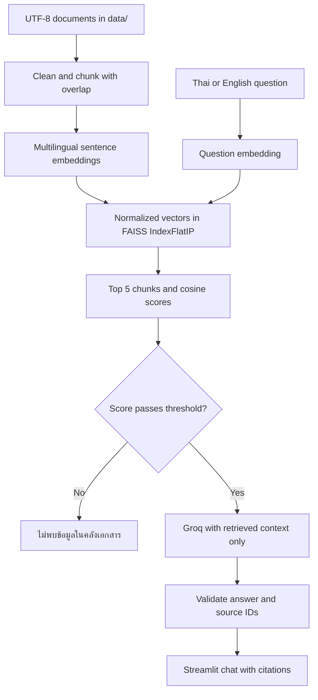

# NetAssist RAG — Network Troubleshooting Assistant

แชตบอตภาษาไทย/อังกฤษสำหรับเรียนรู้และวิเคราะห์ปัญหาเครือข่ายจากคลังเอกสารที่จัดเตรียมไว้ ช่วยลดการค้นหาข้ามหลายหัวข้อและแสดงหลักฐานประกอบคำตอบ เหมาะกับงานมหาวิทยาลัยที่ต้องสาธิต RAG โดยตรง ไม่ควรนำคำแนะนำไปเปลี่ยนระบบจริงโดยไม่ตรวจ platform และสิทธิ์ดำเนินการ

## สถาปัตยกรรมและขั้นตอนทำงาน



1. `load_documents()` อ่านไฟล์ `.txt` จาก `data/` ด้วย UTF-8 และเก็บชื่อไฟล์
2. `clean_text()` ปรับช่องว่างและ normalize ภาษาไทยด้วย PyThaiNLP โดยรักษาย่อหน้า
3. `chunk_documents()` รักษาขอบเขตย่อหน้า แบ่งไม่เกิน 1,000 ตัวอักษร และตรวจด้วย tokenizer จริงให้ไม่เกิน 128 tokens รวม special tokens; เพิ่ม overlap สูงสุด 150 ตัวอักษรเฉพาะเมื่อยังอยู่ใน token budget แต่ละ chunk มี `source`, `chunk_number`, `text`
4. `load_embedding_model()` โหลด `sentence-transformers/paraphrase-multilingual-MiniLM-L12-v2` บน CPU ครั้งเดียวด้วย `st.cache_resource` รองรับไทยและอังกฤษ และสร้างเวกเตอร์ 384 มิติ
5. `build_faiss_index()` normalize embedding และใช้ `faiss.IndexFlatIP` ทำ inner product ซึ่งเท่ากับ cosine similarity เมื่อเวกเตอร์มีความยาวหนึ่ง
6. cache ของคลังความรู้เก็บ index และ chunks โดย hash เนื้อหาเอกสาร เมื่อไฟล์หรือรุ่น pipeline เปลี่ยนจะสร้างใหม่ ไม่ embed ทุกครั้งที่ Streamlit rerun
7. คำถามถูก embed และค้นหา Top-K = 5 แล้วกรองแต่ละ chunk ด้วย `RETRIEVAL_THRESHOLD` ก่อนส่งให้ LLM
8. Groq ได้เฉพาะคำถามปัจจุบันและ retrieved context ประวัติแชตแสดงใน UI และคงอยู่ใน session แต่ไม่ส่งเป็นหลักฐานให้โมเดล คำถามต่อเนื่องควรระบุหัวข้อให้ครบ
9. ตรวจ JSON และ citation ให้เป็น source ID ที่ถูก retrieve จริง ก่อนแสดงข้อความพร้อมส่วนขยายอ้างอิง

## Threshold และการปฏิเสธคำถาม

ค่าที่ปรับจากชุดทดสอบ `RETRIEVAL_THRESHOLD = 0.38` อยู่ใกล้ต้น `app.py` หากไม่มี chunk ผ่าน จะตอบ **ไม่พบข้อมูลในคลังเอกสาร** ทันทีโดยไม่เรียก API และไม่แสดงแหล่งข้อมูลที่ไม่เกี่ยวข้อง หาก context ไม่พอ Groq ถูกสั่งให้ตอบข้อความเดียวกัน หาก structured citation ถูกต้องแต่ไม่มี inline tag แอปจะเติม tag จาก ID ที่ตรวจแล้ว หาก JSON/citation ผิด จะแสดงข้อผิดพลาดรูปแบบคำตอบแยกจาก NOT_FOUND ไม่แสดงว่าเอกสารไม่มีข้อมูล การตรวจ citation ยืนยันว่าแหล่งอ้างอิงมีอยู่ แต่ไม่ได้พิสูจน์ทุกข้อเท็จจริงของโมเดล ต้องตรวจคุณภาพคำตอบด้วยผู้สอนด้วย

Cosine score ไม่ใช่ความน่าจะเป็น Threshold ต้องปรับจากผลชุดคำถามจริงเมื่อเปลี่ยนข้อมูลหรือโมเดล ชุดทดสอบมีคำถามเครือข่ายและนอกคลัง เช่น Kubernetes/Helm กับ PostgreSQL การผ่านชุดนี้ไม่รับประกันว่าจะแยกคำถามนอกคลังทุกแบบได้

## Prompt Engineering และ Groq

ใช้ official Python SDK `groq` (`from groq import Groq`) อ่าน key จาก `st.secrets["GROQ_API_KEY"]` เท่านั้น โมเดลกำหนดที่ `GROQ_MODEL` ใกล้ต้น `app.py`: `openai/gpt-oss-120b` ส่ง system instruction และ retrieved context ผ่าน `client.chat.completions.create` พร้อม JSON response mode; สร้าง Groq client เฉพาะเมื่อมีคำถามที่ผ่าน retrieval threshold เท่านั้น

ตัวอย่างรูปแบบการเรียก:

```python
client = Groq(api_key=st.secrets["GROQ_API_KEY"])
response = client.chat.completions.create(
    model="openai/gpt-oss-120b",
    messages=[
        {"role": "system", "content": SYSTEM_PROMPT},
        {"role": "user", "content": build_prompt(question, sources)},
    ],
    temperature=0.1,
    response_format={"type": "json_object"},
    max_tokens=4096,
)
```

ตัวอย่างคำสั่งหลักที่ส่งผ่าน system instruction:

```text
You are a Network Troubleshooting Assistant.
Answer ONLY from the provided retrieved context; never use outside knowledge.
Never invent commands, causes, configurations, solutions, or sources.
If evidence does not fully support an answer, set answer to exactly
'ไม่พบข้อมูลในคลังเอกสาร' and citations to [].
Answer in Thai for Thai questions and English for English questions.
Explain diagnosis logically. Cite every factual paragraph using [source_id].
Only cite IDs from the context. Return JSON with answer and citations.
```

Prompt จริงอยู่ใน `SYSTEM_PROMPT` และเพิ่มกฎไม่ทำตามคำสั่งแทรกในเอกสาร/คำถามและไม่เปิดเผย prompt ใช้ temperature ต่ำ ไม่ใช้ web grounding หรือความรู้ภายนอก เมื่อไม่มี key แสดงวิธีตั้งค่า เมื่อ API มีปัญหาแสดงข้อความที่เข้าใจได้โดยไม่เผย traceback หรือข้อมูลคำขอ

## โครงสร้างโปรเจกต์

```text
network-troubleshooting-rag/
├── app.py
├── data/
│   ├── 01_osi_tcpip.txt
│   ├── 02_ip_subnetting.txt
│   ├── 03_vlan_trunking.txt
│   ├── 04_stp_rstp.txt
│   ├── 05_ospf.txt
│   ├── 06_dhcp_dns.txt
│   ├── 07_nat.txt
│   ├── 08_firewall_acl.txt
│   ├── 09_vpn.txt
│   ├── 10_network_troubleshooting.txt
│   ├── 11_ethernet_switching.txt
│   ├── 12_tcp_udp_icmp.txt
│   ├── 13_arp_mac_table.txt
│   ├── 14_wireless_network.txt
│   ├── 15_ipv6.txt
│   ├── 16_network_security.txt
│   ├── 17_network_services.txt
│   ├── 18_packet_analysis.txt
│   └── 19–48: เอกสาร CCNA เพิ่มเติม (ดู CCNA_COVERAGE.md)
├── .streamlit/config.toml
├── .streamlit/secrets.toml.example
├── .gitignore
├── requirements.txt
├── test_questions.csv
├── test_rag.py
└── README.md
```

## ติดตั้งและรันในเครื่อง

แนะนำ Python 3.12 ในโฟลเดอร์โปรเจกต์:

```bash
python3 -m venv .venv
source .venv/bin/activate
python -m pip install -r requirements.txt
streamlit run app.py
```

บน Windows ใช้ `py -3.12 -m venv .venv` และ `.venv\Scripts\activate` เปิด URL ที่ Streamlit แสดง ปกติ `http://localhost:8501` ครั้งแรกต้องเชื่อมต่อ Hugging Face เพื่อดาวน์โหลด embedding model ครั้งถัดไปใช้ cache ในเครื่อง ติดตั้ง PyTorch แบบ CPU หากต้องลดพื้นที่ติดตั้งบน Linux:

```bash
python -m pip install torch --index-url https://download.pytorch.org/whl/cpu
python -m pip install -r requirements.txt
```

### Streamlit Secrets

สร้าง `.streamlit/secrets.toml` ในเครื่องเอง หรือใส่ในช่อง Secrets บน Cloud:

```toml
GROQ_API_KEY = "your_groq_api_key_here"
```

แทน placeholder ด้วย key ของตนเองจาก Groq Console ระบบอ่าน key จาก `st.secrets` เท่านั้น ไม่อ่าน `.env` หรือ environment variable ไม่ต้องเพิ่ม key ใน source code หากยังไม่มี key แอปเปิดได้และทดสอบการค้นหา/การปฏิเสธได้ แต่สร้างคำตอบจาก Groq ไม่ได้

## ทดสอบ

```bash
python test_rag.py
```

ชุดทดสอบโหลดข้อมูลจริง ตรวจจำนวนเอกสารและตัวอักษร, chunking, overlap, embedding count/dimension/normalization, จำนวนเวกเตอร์ FAISS, relevant sources และคะแนนคำถามนอกคลัง รวมถึงตรวจว่าไม่เรียก Groq สำหรับคำถามที่คะแนนต่ำ ทดสอบ citation ที่ผิดด้วย mock และใช้ Streamlit AppTest ตรวจหน้าจอ, missing secrets, ประวัติ และ Clear Chat ไม่มีการใช้ quota Groq ในชุดทดสอบ

`test_questions.csv` มี 59 กรณีและ 4 `NOT_FOUND` โดยเก็บ regression เดิมทั้งหมดและเพิ่มกรณีสำหรับเอกสาร CCNA ใหม่ รวม FTP/TFTP และสิทธิ์ Cisco IOS หลังตั้ง key ให้ลองถามจริงและตรวจความถูกต้องกับเอกสารเพิ่มเติม ห้ามถือว่าการทดสอบ retrieval เป็นการทดสอบคุณภาพคำตอบจาก Groq

## Deploy บน Streamlit Community Cloud

1. นำไฟล์โปรเจกต์ขึ้น repository ของตนโดยไม่รวม `.venv/` และ secrets จริง
2. บน Streamlit Community Cloud เลือก repository/branch และ entry point `app.py`
3. เลือก Python 3.12 ใน advanced settings และใส่ `GROQ_API_KEY` ใน Secrets
4. Deploy แล้วรอการติดตั้งและดาวน์โหลดโมเดลครั้งแรก ตรวจ log ถ้า dependency หรือ network ล้มเหลว
5. ลองคำถามไทย อังกฤษ และคำถามนอกคลัง ตรวจ citation และ Clear Chat

ใช้ pathlib ไม่มี path เฉพาะเครื่องในแอป ไม่มีฐานข้อมูลหรือ backend เพิ่ม โมเดลและ index แชร์ด้วย cache_resource เพื่อประหยัด RAM จำนวนข้อมูลนี้มีขนาดเล็ก แต่ runtime ของ PyTorch ใช้หน่วยความจำมากกว่า index ควรเฝ้าดู resource หากเพิ่มข้อมูลจำนวนมาก requirements ระบุช่วง major version เพื่อช่วย compatibility ควรบันทึกรุ่นที่ทดสอบจริงเมื่อส่งงาน

## คลังความรู้และแหล่งเอกสาร

เอกสารทั้ง 48 ไฟล์ใน `data/` เป็นเนื้อหาการศึกษาที่เขียนใหม่สำหรับโปรเจกต์นี้ ใช้ภาษาไทยและศัพท์เครือข่ายอังกฤษ ไม่ใช่การนำ manual หรือเว็บไซต์ภายนอกเข้า index หัวข้อครอบคลุม OSI/TCP-IP, subnetting, VLAN, STP, OSPF, DHCP/DNS, NAT, ACL/firewall, VPN วิธี troubleshooting, Ethernet switching, TCP/UDP/ICMP, ARP/MAC table, wireless, IPv6, network security, services และ packet analysis ตัวอย่างคำสั่งระบุ platform เมื่อจำเป็น ต้องปรับ interface และ address ให้เข้ากับระบบจริง

ขยายเพิ่ม 30 เอกสารครอบคลุม Network Fundamentals, Network Access, IP Connectivity, IP Services, Security Fundamentals และ Automation/Programmability รวม lab commands และขั้นตอนตรวจปัญหา ดูรายละเอียดการจับคู่หัวข้อและลำดับการเรียนใน [CCNA_COVERAGE.md](CCNA_COVERAGE.md)

ตัวอย่างคำถาม:

- OSPF neighbor ค้าง EXSTART ต้องตรวจอะไร?
- เครื่องต่าง VLAN สื่อสารไม่ได้ต้องตรวจ trunk และ gateway อย่างไร?
- DHCP client ไม่ได้รับ IP ต้องตรวจ DORA อย่างไร?
- DNS resolution fails but access by IP works. What should I check?
- VPN ส่ง packet เล็กได้แต่เว็บค้างเกี่ยวข้องกับ MTU อย่างไร?
- How do I troubleshoot TCP retransmission and duplicate ACK?

## ความปลอดภัยของ API Key

ห้าม commit API key เพราะผู้ที่เห็นสามารถใช้ quota และสิทธิ์ของบัญชีได้ `.gitignore` ปิด `.streamlit/secrets.toml`, `.env`, virtual environments และ bytecode มีเพียงไฟล์ example ที่ไม่มี credentials หาก key เคยถูกเผยแพร่ต้อง revoke/rotate ที่ผู้ให้บริการ การลบออกจากไฟล์ล่าสุดอย่างเดียวไม่ลบจากประวัติ Git คำถามกับ retrieved context ถูกส่งให้ Groq เมื่อผ่าน threshold จึงไม่ควรเพิ่มข้อมูลลับในคลังหรือแชต

## ตรวจ retrieval และผลแก้ไข

```bash
python debug_retrieval.py
python test_rag.py
```

`debug_retrieval.py` ไม่เรียก Groq API แสดง OSPF Top-5, ตารางทุกคำถาม, จำนวนเวกเตอร์, token limit และ L2 norms บันทึกผลที่ `diagnostics/retrieval_results.csv` และ `diagnostics/retrieval_details.json` ผลก่อนแก้อยู่ใน `diagnostics/ospf_before.json` ดูรายงานเต็มใน [diagnostics/retrieval_fix_report.md](diagnostics/retrieval_fix_report.md)

เปิด **Show Retrieval Debug** ใน sidebar เพื่อแสดง source, chunk, cosine score, ผล threshold และขั้นที่เกิดปัญหาใต้ข้อความตอบ เช่น `retrieval_below_threshold`, `model_insufficient_evidence`, `invalid_model_output`, `processing_error` โหมดนี้ไม่แสดง prompt หรือ key ส่วน Retrieved Sources แสดงเฉพาะ chunks ที่อ้างในคำตอบ

ชุดทดสอบล่าสุดผ่าน 8 tests รวม UI ที่จำลองคำตอบ OSPF พร้อม citation, Retrieval Debug, missing secrets, ล้างบทสนทนา และปุ่มคำถามตัวอย่างที่ submit ผ่าน pipeline เดียวกับแชต (ไม่มี API call ใน automated tests)

ผลหลังขยายคลัง CCNA: 48 เอกสาร, 87,131 ตัวอักษรก่อน clean และ 87,082 หลัง clean, 261 chunks / FAISS vectors 384 มิติ ทุก chunk ไม่เกิน 128 tokens ทั้ง document/query มี L2 norm ใกล้ 1 Retrieval ผ่านทั้ง 59 คำถาม คำถาม GROUNDED มีคะแนนสูงสุดต่อคำถามต่ำสุด 0.4304 ส่วน NOT_FOUND สูงสุด 0.3269 จึงคง threshold 0.38 ดู [รายงานล่าสุด](diagnostics/ccna_expansion_report.md) และ [ตารางผลทุกคำถาม](diagnostics/retrieval_results.csv)

## หน้าจอ NetAssist RAG

- Header ระบุ Network Troubleshooting Assistant พร้อม capability tags: Routing, Switching, Firewall, VPN, TCP/IP และ Wireless
- Sidebar แสดง status ตามความพร้อมของคลังและ API, Documents, Chunks และ Knowledge Coverage
- Technology อยู่ใน expander; full model path, IndexFlatIP, Top-K, threshold และ debug control อยู่ใน Advanced RAG Details
- Empty state มีคำถามตัวอย่าง 4 ข้อ กดเพื่อส่งคำถามจริง ไม่ใช่คำตอบที่เตรียมไว้ ประวัติไม่ถูกเพิ่มซ้ำเมื่อ rerun
- Retrieved Sources แสดงชื่อไฟล์, chunk, cosine และ preview พร้อม Full evidence expander คงข้อความอ้างอิงทั้งหมดให้ตรวจได้
- NOT_FOUND คง answer string เดิมเป๊ะ คำแนะนำหัวข้อที่ถามได้เป็น UI caption แยกต่างหาก
- CSS ใช้เฉพาะ class ที่แอปสร้าง ไม่ซ่อน Streamlit controls ไม่เพิ่ม UI library หรือ embedding model ใช้ native layout และ tags ที่ wrap ตามหน้าจอ

Groq ใช้รุ่น `openai/gpt-oss-120b`; provider migration เปลี่ยนเฉพาะ API call/secret/model และคง retrieval, prompt grounding, citation validation, UI, เอกสาร, FAISS และ threshold 0.38 ไว้ การทดสอบใช้ mock จึงไม่ส่งคำถามหรือข้อมูลออกไปยัง API


## Groq SDK และ model availability

หลังเปลี่ยน requirements ให้ติดตั้ง dependency ใน virtual environment ที่ใช้รัน Streamlit ด้วย `python -m pip install -r requirements.txt` รอบตรวจ local พบว่า SDK ยังไม่ติดตั้ง (`ModuleNotFoundError: No module named 'groq'`) และเมื่อติดตั้ง groq 0.37.1 แล้ว โมเดลเดิมตอบ HTTP 404: `The model llama-3.3-70b-versatile does not exist or you do not have access to it.`

จึงเปลี่ยนเฉพาะ `GROQ_MODEL` เป็น `openai/gpt-oss-120b` หลังยืนยันจาก Models API ว่าบัญชีนี้เข้าถึงได้ และเป็น production text model ใน [Supported Models ของ Groq](https://console.groq.com/docs/models) ไม่เปลี่ยน retrieval, FAISS, documents, chunking หรือ threshold 0.38

หลังแก้ ทดสอบคำถาม “OSPF Neighbor ค้างอยู่ที่ EXSTART เกิดจากอะไร?” ผ่าน Groq จริงหนึ่งครั้งสำเร็จ ได้คำตอบ grounded พร้อม citations จาก `05_ospf.txt` และผ่าน citation validation เดิม ไม่มีการเปิดเผยหรือแก้ secrets ไม่มีการ commit/push
